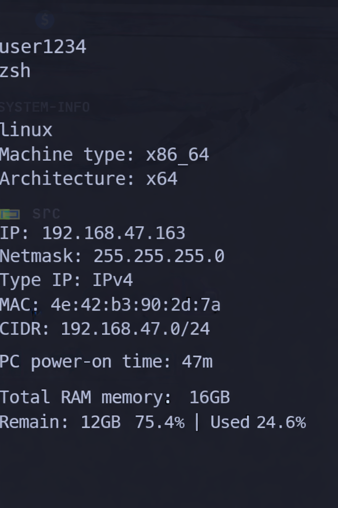

# System Info (Node.js)

A small Node.js CLI tool that displays basic system and network information in real time.

## What it shows

- Username
- User shell
- Platform
- Machine type
- System architecture
- Network information:
  - IP address
  - Netmask
  - IP family (IPv4)
  - MAC address
  - CIDR
- System uptime
- Total RAM memory
- Free RAM memory
- RAM usage percentage (free and used)

#### Example


The information is refreshed automatically at a fixed interval.

### RAM usage details

The tool now shows RAM usage percentages based on total and free system memory.

Example output:

```
Total RAM memory: 16GB
Remain: 6GB   37% | Used 63%
```

## Requirements

- Node.js (v18 or newer recommended)
- npm

## Installation

```bash
npm install
```

### Global CLI (optional)

You can link the project globally to call it from anywhere in your terminal:

```bash
npm link
```

This will register the following command:

```bash
system-info
```

## Run

Local run:

```bash
npm start
```

Global run (after `npm link`):

```bash
system-info
```

### Notes

- Network information updates automatically when the network connection changes.
- If no network interface is available, the program will continue running without crashing.
- Designed as a simple learning project focused on async control and error handling in Node.js.

## 👤 Vinci

[@Vincixd09](https://github.com/Vincixd09)

